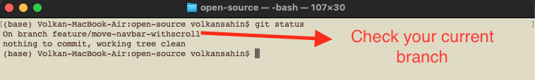
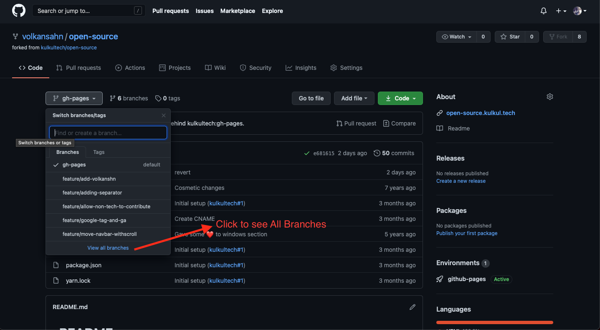
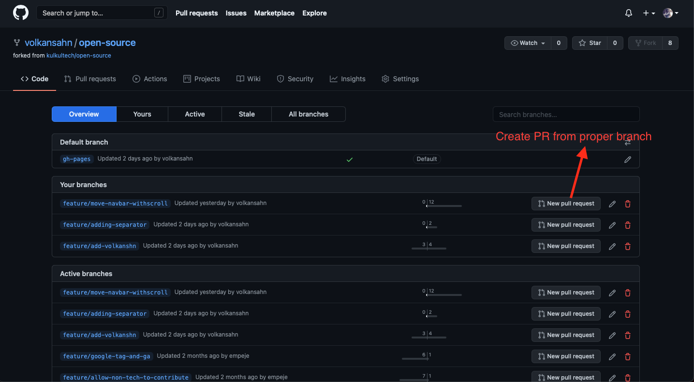

# Frequently Asked Questions and Guidelines
## 1. How to Make a PR (Pull Request) ?

The very first thing to do before making a PR is creating a new branch for your PR.

The important point for vreating branch is CREATE BRANCH FROM YOUR MASTER BRANCH.

- Open the Terminal
- Go to your project directory
- Check current status.
```
git status
```

Be sure to be on the master Branch of your project.
- Then create a new breanch from master branch.
```
git checkout -b [your branch dir/your branch name]
```
- This command will create a new branch and bring you to this branch.
- Then do your changes on project.
- Check status.
```
git status
``` 
- You should see your changes.
- Add this changes.
```
git add .
```
- Commit your changes on your local repo. Always write comment on your commits.
```
git commit -m "[your message]"
```
- Commit your changes to remote repo (at Github.com).
```
git push origin [your branch dir/your branch name]
``` 
- As you are using SSH (made on [Step 2](https://open-source.kulkul.tech/en_ID/#!pages/internship.md#Step_2_-_Learn_how_to_use_SSH), this step may ask you your pass (in case you defined))
- Then you can check github page and see your changes pushed on the server.
- Github automatically ask you if you want to create PR with your changes.
- If you cant see automatic PR from github;
	- Click branch drop down list
	
	- Create PR from the branches that you made commit.
	